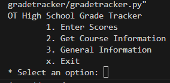
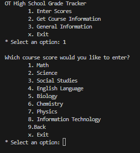
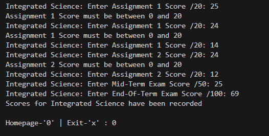
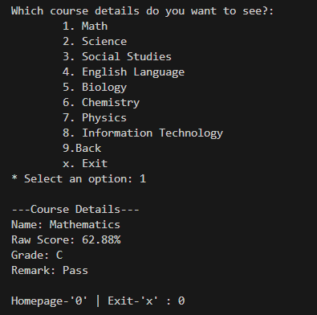
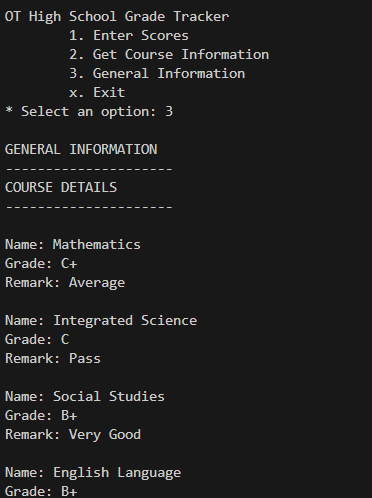
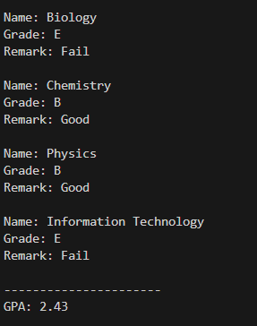

# OT High School Grade Tracker

This Python program helps track grades for courses at OT High School. It allows entering scores for various subjects, viewing course details, and provides general information about grades.

## Features:

- **Enter Scores:** Record scores for different courses including assignments and exams.
- **View Course Information:** Display details such as the course name, raw score, grade, and remark.
- **General Information:** View cumulative GPA, grades, and remarks for all courses.
- **Simple Interface:** Easy-to-use command-line interface.

## Getting Started

### Prerequisites:

- Python 3.0 or above installed on your system.

### Running the program:

1. Copy the code to your local machine.
2. Open your terminal and navigate to the directory containing the file.
3. Run the program using the following command:
    ```bash
    python gradetracker.py
    ```

## Using the Program

The program presents a menu-driven interface. Select the desired option by entering the corresponding number:

1. **Enter Scores:** Record scores for assignments and exams of different courses.
2. **View Course Information:** Display details for a specific course including grade and remark.
3. **General Information:** View cumulative GPA, grades, and remarks for all courses.
4. **Exit (x):** Exit the program.

### Course Grades and Remarks:

Grades and remarks are assigned based on the final score obtained as follows:

- A+: Outstanding (85% and above)
- A: Excellent (80% - 84.99%)
- B+: Very Good (75% - 79.99%)
- B: Good (70% - 74.99%)
- C+: Average (65% - 69.99%)
- C: Pass (60% - 64.99%)
- D+: Poor (55% - 59.99%)
- D: Very Poor (50% - 54.99%)
- E: Fail (Below 50%)

### Preview

Here's a preview of various parts of the program's interface:

<a href="screenshots_g/1.png"></a><br>
<a href="screenshots_g/2.png"></a><br>
<a href="screenshots_g/3.png"></a><br>
<a href="screenshots_g/4.png"></a><br>
<a href="screenshots_g/5.png"></a><br>
<a href="screenshots_g/6.png"></a>


## Author

[Oswald Amoah](https://lnk.bio/oswaldamoah)

